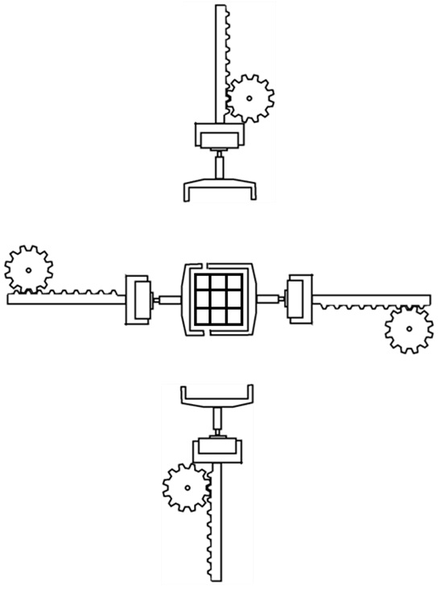

# Rubik's Cube Project

## Design Outline
This project runs Kociemba's algorithm on a Raspberry Pi to generate a solution to the scramble. All source code can be found in the src folder.
The Design of robot involves 4 robot arms. Each with 1 prismatic joint and 1 revolute joint, allowing for 2 degrees of freedom.



as shown above, revolute joints are controlled by stepper motors, while prismatic joints are controlled by servo motors with assistance of a 3D printed rack and pinion system.

STL files for all parts necessary for the design can be found in the 3D Design folder.

Colour recognition of faces of cube will be done using OpenCV and Raspberry Pi Camera.

Pinion is designed to fit servo horn of an MG996R servo motor, while the passive grippers are designed to fit the shaft of a NEMA-17 stepper motor.

## Project Aims

The robot will be able to fully complete 3x3 Rubik’s cubes from different models, the robot must also adjust for different centre piece shapes.
The robot will be able to solve a cube without being permanently attached it.
The robot will be able to scramble a given cube using the official TNoodle scrambling algorithm.

The secondary aims of the project include:
 * For the robot to obtain an average of 5 solve time under 150 seconds.
 * For the robot to have a mobile app through which a user can send scrambles for the robot to scramble a cube for them.


## Build Steps

```
# dependencies
sudo apt install libffi-dev

# install venv
sudo apt install python3-venv

# create virtual environment
python3 -m venv env

# activate virtual environment
source env/bin/activate

# install pip packages
pip install -r requirements.txt

# run code
python3 src/koceimba_test.py
```

